# `ripbi deps`: explore dependencies

Use `deps` after a scan to see what an object depends on and what would be
affected if it changed. These examples run from the root of a clone of this
repository and use the committed AdventureWorks model:

```sh
ripbi deps "'Sales'[Sales]" --model "samples/AdventureWorks Sales.SemanticModel"
ripbi deps "'Sales'[Sales]" --model "samples/AdventureWorks Sales.SemanticModel" --impact --depth 1
ripbi deps --model "samples/AdventureWorks Sales.SemanticModel" --table Sales
```

The default view shows dependencies above impact. Dependencies are what the
object uses; impact is what uses it, including report bindings when reports
are connected. `--model` also works without reports for model-only exploration.
An empty impact is a valid result, not an error.

The rest of this page is the detailed reference for lookup, filters, output
formats, and exit codes.

<!-- Maintainers: deps.rs and deps/render.rs implement this contract. -->



## Command forms

```
ripbi deps [OBJECT] [flags]
ripbi deps --table NAME [flags]
ripbi deps --type TYPE [flags]
ripbi deps [OBJECT] --model PATH [--report PATH]... [flags]
ripbi deps [OBJECT] --queries-from LOG [flags]
```

`OBJECT` is the only positional operand — the one deliberate exception to the
flags-over-positionals preference, because `deps` has one natural subject. A filesystem
path is never inferred from it: model and report inputs arrive only through `--model`
and `--report`.

## Model and report inputs

The target ladder is scan's: `--model PATH` first, else the `ripbi.toml` `target`, else
derivation from the `--report` anchors alone (every anchor must pair with the same
model), else current-directory discovery (one candidate announced, several prompt with
the numbered picker on a TTY stdin, none is an error). `--report PATH` (repeatable) adds
reports as binding sources the same way scan takes them, search folders included; a
`.pbip` value expands to its project's reports.

One deliberate difference from scan: **a model with no reports is valid**. There is no
zero-connected-report refusal and no `--allow-no-reports` — liveness is not the
question here, and the intra-model dependency graph is fully explorable without any
report. The announce line says so: `Exploring X with no reports`.

## Streams

| Content | Stream | Notes |
|---|---|---|
| The view: focused trees, diagrams, overview, JSON, plain records | stdout | the machine-readable side |
| Discovery/selection announce, exploring line | stderr | one line each; the exploring line counts the paired reports (`--verbose` names them) |
| Pairing notes (`Note:` by-name matches, `Ignored … bound to other models`) | stderr | capped lines, as in scan |
| Coverage caveat | stderr | once per run |
| Skip notices (parser drift, stale saved state, unresolved dataset references) | stderr | grouped under one header, in every mode — the JSON documents the graph, not the run |
| Errors + hints | stderr | `error: …` / `hint: …` |

`-q/--quiet` suppresses everything on both streams; the exit code is the only output.

## Object lookup

References are resolved by the shared lookup in `ripbi-core`, so ambiguity rules and
suggestions behave the same here as in any future command. Accepted forms:

- member shorthands: `'Sales'[Sales]`, `Sales[Sales]` — match every member
  kind in the named table (column, measure, hierarchy, calculation item);
- an unqualified `[Name]` — matches the global measure of that name, every table's
  member of that name, and report measures;
- bare names — the global namespaces only: tables, measures, shared expressions,
  functions (so the issue's `"Sales"` matching both the table and its same-named
  measure is ambiguity, never a guess);
- every object's full display form — `table 'Sales'`,
  `hierarchy 'Date'[Calendar]`, `partition 'Sales'[Sales]`,
  `relationship 'Sales'[Key] -> 'Dim Old'[Key]` — is matchable verbatim, covering the
  kinds no shorthand addresses.

Ambiguity is never resolved silently:

```text
error: "Sales" matches multiple objects

  table    'Sales'
  measure  'Sales'[Sales]

hint: use a fully-qualified object reference, e.g. 'Table'[Name]
```

A reference matching nothing offers the nearest object by edit distance:

```text
error: object "'Sales'[Totla]" was not found

Did you mean:
  'Sales'[Total]
hint: object names are case-insensitive; quote the table: 'Table'[Name]
```

## Direction

`--dependencies` shows what the object relies on; `--impact` shows what relies on it.
Neither flag — or both — shows the default view with both sections. Impact splits into
`Model` (consuming model objects), `Reports` (the bindings riding on the impact
slice), and `Kept` (the objects on the impact slice a `ripbi_keep` model annotation
keeps, issue #151); an impact with none of them prints `└─ nothing` and still exits
`0`.

`Queried` follows `Kept` when a workspace-monitoring query log is in play (see
[Logged queries](#logged-queries)).

`Kept` answers "why is this alive?" when no report is the reason. Each kept object
prints the annotation's reason — prefixed with the object unless it is the one asked
about, naming the kept table when the annotation sits on the table:

```text
'Sales'[Legacy]  column

Impact

Model
└─ 'Sales'[Legacy Total]  measure

Kept
└─ 'Sales'[Legacy Total]  kept: Used by the Finance Excel pivot (FIN-231)
```

An empty reason reads `kept (no reason given)`; a member of a kept table reads
`kept by table 'Archive': …`. The consumer and report filters leave `Kept` out: an
annotation is neither a visual, a model object, nor in a report.

## Logged queries

`--queries-from PATH` (or `queries_from` in `ripbi.toml`) reads an export of
workspace monitoring's `SemanticModelLogs` `QueryEnd` events — the formats, the KQL
to export them, and the resolution rules are in
[output.md](output.md#logged-queries-workspace-monitoring). Each object on the impact
slice that a logged query names directly gets a `Queried` line: how many queries, by
how many distinct users (never who), the last day seen, the client applications, and
how many distinct reports the queries came from.

```text
'Sales'[Legacy]  column

Impact

Model
└─ 'Sales'[Legacy Total]  measure

Queried
└─ 'Sales'[Legacy Total]  queried 2× by 1 user · last 2026-09-30 · Excel
```

The line is prefixed with the object unless it is the one asked about. Like `Kept`,
the consumer and report filters leave `Queried` out: a logged query is neither a
visual, a model object, nor in an ingested report. A log's report ids are service
GUIDs, which no local report file carries, so they are counted, not matched to the
`Reports` section.

## Depth

`--depth N` traverses at most N edges from each root (minimum edge distance);
`--depth all` — the default — traverses to the leaves. `--depth 0` is a usage error,
not a silent empty view.

## Selection

`--table NAME` roots every member of one table; `--type TYPE` roots every object of one
kind (repeatable). Both together intersect: the members of the table with the kind.
Selectors choose where exploration starts — they never restrict what traversal reaches,
so a `Sales` root may reach `'Exchange Rates'[Rate]`. An unknown `--type` lists the
vocabulary (`table`, `column`, `measure`, `hierarchy`, `partition`, `relationship`,
`role`, `calculation_item`, `expression`, `function`, `report_measure`, `bookmark`);
`bookmark` selects fully stale bookmarks only; a selector
matching nothing is an error.

## Filters

Traversal always runs at full depth; the filters restrict which results are included,
keeping exactly the branches that lead to a match:

- `--consumer TYPE` keeps downstream usages by that kind of consumer. `visual` hands
  the view to the report bindings (the Model section steps aside); a model kind prunes
  the impact tree and drops bindings — a binding is a visual's usage, not a measure's.
- `--in-report NAME` and `--on-page NAME` filter the report bindings by folded name. A
  binding whose site is unnamed never passes a filter it cannot be checked against.

Asking for a filter with `--dependencies` alone is a contradiction, not a silent no-op:
the run fails with a hint.

## Human output

The focused view prints the object, its kind, and one tree section per active
direction:

```text
'Sales'[Total]  measure

Dependencies
├─ table 'Sales'  table
│  └─ partition 'Sales'[Sales]  partition
└─ 'Sales'[Amount]  column
   └─ table 'Sales'  table  ↩ already shown

Impact

Model
└─ nothing

Reports
└─ Mini
   └─ P1
      └─ V1  visual
         └─ Values
```

The projection rules: a node on the current path prints `↺ cycle`; a node expanded
anywhere earlier prints `↩ already shown` instead of duplicating its subtree; children
are identity-sorted. Meaning never depends on colour — the markers are characters, and
the TTY/`CLICOLOR_FORCE`/`NO_COLOR`/`TERM=dumb`/`--no-color` rules are scan's.

When the tree would flood the terminal, the human view stops expanding at a fixed
budget, marks each cut branch with `… N additional branches`, and closes with the
reachable count and pointers at `--depth`, `--graph`, and `--json`. **`--plain` and
`--json` never truncate.**

With no object and no selectors the command prints the compact overview — never the
whole graph:

```text
Dependency graph

6 model objects
7 dependency edges
1 report bindings

By type
  Measures      2
  Columns       2
  Hierarchies   0
  Relationships 0
  Other         2

Try:
  ripbi deps "'Table'[Name]"
  ripbi deps --table Sales
  ripbi deps --type measure
```

`--graph` draws each root's slices as a layered topology diagram instead of a tree:
layers are BFS distances from the root, arrowheads point at the used side (away from
the root for dependencies, back at it for impact). Cycles and long jumps stay unrouted
— the tree and machine modes show them exactly. Past 24 nodes the diagram degrades to
a numbered legend rather than unreadable output.

## `--plain`

One typed record per line, tab-separated, for `grep`/`cut`/`awk`. Never truncated.

```text
dependency	'Sales'[Total]	'Sales'[Amount]	measure_expression
impact	'Sales'[Total]	'Sales'[Margin Color]	measure_expression
binding	'Sales'[Total]	Mini	P1	V1	Values
kept	'Sales'[Legacy Total]	'Sales'[Legacy Total]	Used by the Finance Excel pivot
queried	'Sales'[Legacy Total]	2	2026-09-30 09:45:00.0000000	1	Excel
```

- `dependency` — graph orientation: consumer, what it uses, provenance key.
- `impact` — the queried-object side first, then what uses it.
- `binding` — object, report, page, visual, and the binding role (`Values`) or machine
  kind (`filter`, `sort`, `drillthrough`, `conditional_formatting`, `alt_text`); `-`
  for an absent level.
- `kept` — the kept object on the impact slice, the annotated object (itself, or its
  kept table), and the reason, with tabs and line breaks inside it turned into
  spaces.
- `queried` — an object on the impact slice logged queries name, the query count,
  the last timestamp as exported (`-` when absent), the distinct user count, and the
  comma-joined client applications (`-` when none).

Selector runs merge their roots' slices and drop duplicate records. The overview prints
count records instead (`objects`, `edges`, `bindings`, then one `type	count` line per
bucket).

```console
ripbi deps "'Sales'[Total]" --plain | cut -f1
ripbi deps "'Sales'[Total]" --plain --impact | grep $'\tvisual_binding'
```

## `--json`

The graph itself, not either presentation — `schema_version` 1, pretty-printed with a
trailing newline. Never truncated.

```json
{
  "schema_version": 1,
  "root": { "id": "'Sales'[Total]", "type": "measure" },
  "nodes": [ { "id": "'Sales'[Amount]", "type": "column" } ],
  "edges": [
    {
      "from": "'Sales'[Total]",
      "to": "'Sales'[Amount]",
      "kind": "dependency",
      "provenance": "measure_expression"
    }
  ],
  "bindings": [
    {
      "object": "'Sales'[Total]",
      "report": "Mini",
      "page": "P1",
      "visual": "V1",
      "bookmark": null,
      "mobile": false,
      "binding": "Values",
      "kind": "visual_binding"
    }
  ],
  "kept": [],
  "queried": []
}
```

- `nodes` and `edges` are the union of the active slices; edges keep the graph's
  orientation (consumer → producer) with `kind: "dependency"`, except edges only the
  impact slices reached, which are flipped so `from` is always the queried-object side
  with `kind: "impact"`.
- `provenance` is the snake_case machine key of the relationship — the same key
  `--plain` emits (`measure_expression`, `hierarchy_level`, `table_member`,
  `power_query`, `binding`, …).
- `bindings` keep the full site identity: report, page, visual, bookmark, the
  phone-layout marker, the role, and the machine kind. Selector runs — several roots —
  set `root` to `null`.
- `kept` lists each object on the impact slices a `ripbi_keep` annotation keeps:
  `object`, `annotated` (the object itself, or its kept table), and `reason` (empty
  when the annotation gives none). Empty unless `--impact` is in the view.
- `queried` lists each object on the impact slices that `--queries-from` logged
  queries name: `object`, `count`, `last_seen` (as exported, or `null`), `users` (a
  distinct count), `applications`, and `reports` (service report ids from the
  queries' `ApplicationContext`). Empty without a log or `--impact`.
- The overview prints its counts shape: `objects`, `edges`, `bindings`, and a
  `by_type` object.

```console
ripbi deps "'Sales'[Total]" --json | jq '.edges[] | select(.provenance == "measure_expression")'
ripbi deps "'Sales'[Total]" --json | jq '.bindings[] | .report + "/" + .page'
```

## Exit codes

`deps` is inspection, not a verdict. There is no findings code.

| Code | Meaning |
|---|---|
| 0 | the requested view was produced — including an empty one |
| 2 | usage, discovery, lookup, or analysis error |

## `ripbi.toml`

`target` and `reports` participate in the input ladder exactly as in scan, and
`queries_from` supplies the query log when `--queries-from` is not passed, and
`queries_item` picks its model when `--queries-item` is not. There is no
`[deps]` section; `[scan].ignore` does not apply here — a dependency view must show
what the graph says, ignored or not.

## Known boundaries

- Report sites are not model objects: bindings ride beside the graph as provenance, so
  a visual never appears in the Model tree.
- The auto date/time machinery appears like any other engine relationship — impact on
  a varied date column reaches `LocalDateTable_*`; scan's separate verdict section is
  the liveness view of the same machinery.
- M-named columns (the Power Query supply chain, issue #39) are deliberately not
  edges; they appear in scan findings, not in a dependency tree.
- The diagram view is for focused slices; the degradation threshold (24 nodes) is a
  readability floor, not a data limit — `--json` always carries the complete slice.

## The scan → deps workflow

`scan` answers *is this used?*; when a finding needs a second look, `deps` answers *why
does it exist and what goes with it*:

```console
ripbi scan --type measure
ripbi deps "'Sales'[Legacy Total]" --impact   # everything that references it, transitively
ripbi deps "'Sales'[Legacy Total]" --dependencies   # what it pulls in
```

The `used_by` annotation on a finding shows one hop; the impact view shows the whole
chain at once — the deletion-planning view of the same graph.
