# `ripbi scan`: find unused objects

Find model objects that none of the connected reports reach. These examples
run from the root of a clone of this repository; replace the sample path with
your own PBIP project:

```sh
ripbi scan "samples/AdventureWorks Sales.pbip"
ripbi scan "samples/AdventureWorks Sales.pbip" --summary
ripbi scan --model "samples/AdventureWorks Sales.SemanticModel" --report samples/
```

The first line of output counts objects, reachable objects, report bindings,
and unused objects. Findings below it name objects to investigate; a finding
does not prove deletion is safe when other consumers use the model. Exit `1`
means findings were reported, `0` means none were reported, and `2` means the
scan could not complete. See [what counts as unused](https://bgarcevic.github.io/ripbi/graph.html)
before cleanup.

The rest of this page is the detailed reference for inputs, flags, output
formats, and exit codes.

<!-- Maintainers: render.rs implements this contract; change both together. -->

## Inputs and pairing

```
ripbi scan [PATH] [flags]
ripbi scan --model PATH [--report PATH]... [flags]
```

`PATH` is a `.pbip` file, a project folder, a `.SemanticModel` item folder, or a
`.Report` item folder. A `.Report` pairs with its model by stem sibling
(`X.Report` beside `X.SemanticModel`), sole model sibling, its `definition.pbir`
path — or, when the reference is a `byConnection`, by dataset name, pairing only
when exactly one sibling model's stem or display name carries it. The same tiers
rescue a model-less project: `X.pbip` (or its project folder) with only `X.Report`
beside it pairs with the model that report's reference names. Without PATH
(and without `target` in `ripbi.toml`), scan discovers projects in the current
directory: one candidate is announced and scanned,
several prompt with a numbered picker (on a TTY stdin only — otherwise the scan fails
listing them), none is an error. When PATH (or the `ripbi.toml` `target`) names a
semantic model itself, plain `--report` folders are search folders exactly as with
`--model`; any other target accepts report items only.

`--model PATH` names the semantic model explicitly: a `.SemanticModel` folder, its
`definition/` folder, any folder directly containing `model.tmdl`, or the project's
`.pbip`. It disables
current-directory discovery and the `ripbi.toml` `target`, and reinterprets every
`--report` (or config `reports`) value that is not itself a report item as a **search
folder**: the folder is walked recursively for report items bound to the model. With no
report values at all, the model's parent folder is searched. A PATH that names a
semantic model gets the same search-folder walk for plain `--report` values, but keeps
its convention sibling pairing and does not gain a default search root. Reports pair
with the model
by their `definition.pbir` path first, then by the PBIP stem convention (`X.Report`
beside `X.SemanticModel`), then by the dataset name in a `byConnection` `initial
catalog`. A scan with no connected reports refuses with exit `2` and per-category
counts — unless `--allow-no-reports` turns the refusal into a skip: a
`Skipped …: no connected reports (…)` notice on stderr and exit `0`, with no stdout
output. A report written by `ripbi stub-report` binds nothing, so scan prints
`Note: X.Report is a ripbi stub (no bindings).` for it, and a model whose only
reports are stubs gets the same refusal or skip (issue #130).

With `--report` alone — no PATH, no `--model`, no config `target` — the model is
derived from the named reports' pairing (the same tiers as a `.Report` PATH, so a
`byConnection` report binds to the one sibling model its dataset name matches). Every
anchor must land on the same model, and the scan covers exactly the named reports — no
search-folder walk. A `--report` value that is a `.pbip` expands to its project's
reports.

## Streams

| Content | Stream | Notes |
|---|---|---|
| Findings, summary, JSON, plain records, SARIF, `##vso` commands | stdout | the machine-readable side |
| `--sarif-file`, `--json-file`, `--markdown-file` | the named file | written whatever stdout shows, `-q` included (see [Several outputs from one scan](#several-outputs-from-one-scan)) |
| Discovery/selection announce, scanning line | stderr | one line each; the scanning line counts the bound reports (`--verbose` names them) |
| Pairings made by a walk (`Note:` by-name matches, `Ignored … bound to other models` exclusions) | stderr | informational, never `--strict`-fatal; both collapse to one capped line each (`--verbose` lists every report) |
| Coverage caveat | stderr | once per run |
| Storage source notes (coverage, staleness, an unreadable `.pbi/cache.abf`) | stderr | only when a storage source applies; informational, never `--strict`-fatal (see [Storage sizes](#storage-sizes)) |
| Skip notices (parser drift, stale saved state, unresolved dataset references, opaque native-query sources) | stderr | grouped under one header; suppressed in `--json` mode, where the JSON carries them |
| Errors + hints | stderr | `error: …` / `hint: …` |

`-q/--quiet` suppresses everything on both streams; the exit code is the only output.
Files named by `--sarif-file`, `--json-file`, and `--markdown-file` are still written.

## Model-centric scans (`--model`, or a PATH naming a semantic model)

Whenever reports are discovered by walking search folders — under `--model`, or under a
PATH that names a semantic model with plain `--report` folders (issue #67) — the
pairings that would otherwise be invisible are summarized on stderr (all suppressed by
`-q`). The default reads one line per pairing fact; `--verbose` expands each into the
per-report audit trail:

```text
Scanning models/Sales.SemanticModel with 3 report(s)
Note: 1 report(s) matched by dataset name only (byConnection 'initial catalog' = 'Sales'): Thin.Report
Ignored 1 report(s) bound to other models: HR.Report
```

- The scanning line counts the connected reports — direct `--report` items included.
  `--verbose` appends the report folder names, in ingestion order: under `--model`,
  walked reports by canonical path, then explicitly passed ones; under a model-naming
  PATH, the convention siblings and explicit items first, then the walked ones.
- The `Note:` line flags reports connected by dataset *name* rather than by path or stem,
  because that pairing is weaker than the written `definition.pbir` path — a wrong
  pairing means wrong findings, so the fact always shows. One line per `initial catalog`,
  with the count and up to three names; when a tail is capped, the line points at
  `--verbose`:

  ```text
  Note: 26 report(s) matched by dataset name only (byConnection 'initial catalog' = 'Sales'): Thin1.Report, Thin2.Report, Thin3.Report, … and 23 more — rerun with --verbose to list them
  ```

  `--verbose` lists one line per report instead, with its full path.
- The `Ignored …` line counts report items under the search folders that resolve to a
  different existing model, with up to three names — capped the same way, with the same
  `--verbose` pointer; the flag lists every one. It is informational: those reports are
  not ingested, they
  appear in no output mode, and they never fail `--strict` — a healthy multi-model folder
  must stay scannable. Report items whose reference resolves to nothing become
  `unresolved_dataset_reference` skip notices instead, and a `*.Report` folder with no
  `report.json` anchor becomes a `malformed_report_item` notice; both *do* fail `--strict`.
- Reports passed explicitly with `--report` are taken at face value: they are never
  binding-checked and produce none of these notices. Under a model-naming PATH the
  convention siblings count as explicit in the same sense.

## Exit codes

| Code | Meaning |
|---|---|
| `0` | Clean: nothing unused, no broken finding gates the run, and no auto date/time table unused by reports or dead (objects suppressed by `[scan].ignore` count as handled; an *in use* auto date/time table is informational) |
| `1` | Unused objects found, auto date/time machinery no report binds — or, under `--broken`, broken visual bindings or DAX artifacts found |
| `2` | Error: usage, bad PATH, model-only input, a `--model` search with no connected reports (unless `--allow-no-reports` skips it), unsupported archive, ingestion failure, ambiguous discovery off-TTY — or any skip notice under `--strict` |

Under `--compare-root`, findings that already existed in the other checkout are not
reported, so they cannot fail the run either (see
[Comparing against another checkout](#comparing-against-another-checkout)).

The exit code describes what was *reported*: findings hidden by type selection, and an
Auto date/time section hidden because `--type table` was not selected, cannot fail the
run. Broken visual bindings and DAX artifacts (issues #60/#84) are advisory kinds: they are
*reported* by default, but they gate the exit code only when `--broken` selects them —
an unused-only gate must not start failing because one visual is broken, and a
`--broken` gate must not fail on unused findings. `--strict` and `-q/--quiet` are
unaffected.

## Flags

| Flag | Effect |
|---|---|
| `--json` | JSON on stdout (schema below). Mutually exclusive with `--plain` and `--summary` |
| `--plain` | One `<type>\t<id>` record per finding, for grep/awk |
| `--sarif` | A SARIF 2.1.0 log on stdout for GitHub code scanning and Azure DevOps (see [SARIF](#sarif)). Mutually exclusive with `--json`, `--plain`, and `--summary` |
| `--azure-devops` | One `##vso[task.logissue]` logging command per finding on stdout, so an Azure Pipelines run lists them as warnings and errors (see [Azure DevOps](#azure-devops)). Mutually exclusive with `--json`, `--plain`, `--sarif`, and `--summary` |
| `--sarif-file <PATH>` | Also write the `--sarif` log to `PATH`, whatever stdout shows (see [Several outputs from one scan](#several-outputs-from-one-scan)) |
| `--json-file <PATH>` | Also write the `--json` output to `PATH` |
| `--markdown-file <PATH>` | Also write a Markdown summary to `PATH`, for a CI job summary or pull request comment (see [Markdown](#markdown)) |
| `-s`, `--summary` | Counts only: the summary line and per-type totals, no findings list. Mutually exclusive with `--json`, `--plain`, `--sarif`, and `--azure-devops` |
| `-q`, `--quiet` | No output; exit code only |
| `-v`, `--verbose` | Full pairing audit trail on stderr: every report's name in the scanning line, one pairing note per by-name-matched report, the complete ignored-reports list. The default caps each to one line |
| `--model <PATH>` | Analyze one named semantic model (`.SemanticModel`, its `definition/`, a folder holding `model.tmdl`, or the project's `.pbip`). Disables cwd discovery and the `ripbi.toml` `target`; plain `--report` folders become search folders for reports bound to this model. Conflicts with `PATH` |
| `--report <PATH>` | Extra report root; repeatable. Replaces `reports` from `ripbi.toml`. A `.pbip` expands to its project's reports. When the target is `--model` or a PATH naming a semantic model, a folder that is not itself a report item is searched recursively for reports bound to the model; with no other target, the reports' pairing derives the model and exactly these reports are scanned |
| `--type <TYPE>` | Report only unused objects of the passed types; repeatable, and passed together they union (`--type measure --type bookmark`). Vocabulary is the machine kind keys shared with `deps --type`: `table`, `column`, `measure`, `hierarchy`, `partition`, `relationship`, `role`, `calculation_item`, `expression`, `function`, `report_measure`, `bookmark`. Filters every output mode and the exit code. With none of them, everything is reported |
| `--broken` | Report broken visual bindings and DAX artifacts with unresolved references (issues #60/#84). Unions with the type selection (`--broken --type measure` gates on both); alone, it scopes the run to breakage. Without `--broken` or `--type`, breakage is reported but does not change the exit code. `unknown_object` model skips suppress breakage claims — see the precision bar under Human output |
| `--sort <KEY>` | Order unused findings by `name` (the default: object identity) or `size` (largest storage first, findings without size data last, identity order among equals) in every output mode; human groups keep their fixed order and sort within. Size data comes from PBIX and `.abf` models, or from a storage source attached to any other model (see [Storage sizes](#storage-sizes)); without it `size` keeps name order and says so in a `Note:` on stderr |
| `--stats-from <PATH>` | Attach storage sizes to a model with no catalog of its own (PBIP, TMDL, `model.bim`, PBIT) from an `.abf` backup, a PBIX saved with its data, or a VertiPaq Analyzer `.vpax`; `none` turns off `.pbi/cache.abf` auto-detection. Replaces `[scan].stats_from`. A usage error (exit `2`) on a PBIX or `.abf` model, or when the source cannot be read or has no storage catalog. See [Storage sizes](#storage-sizes) |
| `--compare-root <DIR>` | Rerun the same scan in another checkout (the base branch, a previous release) and report and gate on only the findings that did not exist there; findings gone since are listed as fixed. Exit `2` when `DIR` is not a folder. See [Comparing against another checkout](#comparing-against-another-checkout) |
| `--compare-label <NAME>` | What the output calls the `--compare-root` checkout, e.g. the branch it holds: `(412 findings already in main)`. Defaults to `DIR` as given. `--json`'s `compare.root` stays `DIR`. Needs `--compare-root` |
| `--power-query` | Also print the `⭘ Power Query also names it` annotations (human output; a no-op in `--plain`, `--json`, and `-q`, whose consumers filter themselves) |
| `--strict` | Any parser skip notice becomes exit code `2` |
| `--allow-no-reports` | Skip a model with no connected reports instead of refusing with exit `2`: a `Skipped …` notice on stderr (suppressed by `-q`), exit `0`, and no stdout output in any mode. Lets a pipeline point the scan at every model and let each run decide whether it has anything to scan against — models are re-checked every run, so no exclusion list is needed |
| `--no-color` | Never color, and no progress ticker (both are also off off-TTY, under `NO_COLOR`, or `TERM=dumb`; the ticker also needs a TTY stdout and human mode). `CLICOLOR_FORCE=1` turns color, never the ticker, on off-TTY, e.g. for CI logs |
| `--no-input` | Never prompt; fail where a picker would appear |

## Human output (default)



```text
130 objects, 74 reachable from 51 roots, 56 unused

Measures (11)
  'Sales'[Average Sales per Order]
    ← nothing references it
Columns (28)
  'Customer'[City]
    ← only used by hierarchy 'Customer'[Geography] — hierarchy level (also unused)
  'Customer'[Customer ID]
    ← nothing references it
```

- The summary line: total graph objects, how many reachability reached, from how many
  report binding roots, and the unused count. Roots are report bindings — the desktop
  tree and the phone layout (`definition.mobile/`, issue #49) alike; RLS roles also
  seed reachability without counting here. When `[scan].ignore` suppressed objects, a
  second line says how many; when the type selection hid findings, a third line counts them
  (`(2 unused hidden by type filters)`); and when auto date/time machinery members are
  covered by the section's table verdicts, a fourth counts them, so `0 unused` from a
  filtered or machinery-heavy model never reads as a clean one by accident.
- Findings are grouped by object type (measures, columns, hierarchies, tables,
  partitions, relationships, calculation items, expressions, functions, report
  measures, bookmarks — fixed order, empty groups omitted), sorted by object identity. The type
  flags restrict the groups to the selected kinds; empty groups are still never printed.
- Chain annotations, one per referencing object:
  - `← nothing references it` — a true orphan, deletable outright;
  - `← only used by 'X' — <where> (also unused)` — the sole (or all-identical case:
    every) consumer is itself unused, so the whole chain can go;
  - `← used by 'X' — <where>` — the consumer is live but its use could not keep this
    object alive (a key column held only by an active relationship endpoint, or the
    table of an inactive relationship nothing activates).
- The `⭘ Power Query also names it (…)` annotation appears, behind `--power-query`,
  on Data columns named by M expressions. With the flag, the last finding above
  reads:

  ```text
    'Customer'[Customer ID]
      ← nothing references it
      ⭘ Power Query also names it ('Customer' partition) — safe to stop loading; removing it from the script means editing those steps too
  ```

  It is supply-chain context, not a consumer:
  unloading the column cannot break refresh, but removing it from the Power Query
  script *entirely* means editing each named partition or expression too — cleanup-time
  guidance, so it is hidden by default and shown only on request. Columns without the
  annotation are also gone from every Power Query step — and engine-computed columns
  (calculated columns, auto date/time machinery) never carry it, because an M step can
  only name a column it produces. `--json` always carries the underlying
  `named_in_power_query` field regardless of the flag.
- The **Broken artifacts** section follows unused findings (issue #84): one row per
  DAX owner with unresolved field references, whether or not a visual binds it.
  Indented lines list the distinct written references. Report-level measures
  include their report path; model objects have no report path. Several broken
  properties of one object still produce one row. M expressions are not checked.
  The section is advisory unless `--broken` is selected.
- The **Broken visual bindings** section follows the artifact section (issue #60): one row per
  report binding whose written field reference resolves to nothing in the model, or
  that lands on an artifact whose own DAX no longer resolves — the static form of the
  error state the service would render. Each row names the written reference, the
  reason, and the binding's site:

  ```text
  Broken visual bindings (2)
    'Sales'[Color]
      ← field not found in the model — field well 'Values' — visual 'V2' on page 'P1'
    'Sales'[Broken Total]
      ← bound artifact 'Sales'[Broken Total] has unresolvable references — field well 'Values' — visual 'V3' on page 'P1'
  ```

  The section is a different verdict than reachability's — written references, not
  graph liveness — so it prints even on an otherwise clean `No unused objects.` scan,
  and it is *advisory*: it never changes the exit code unless `--broken` selects it.
  Under a lone `--broken`, the findings list is empty by construction — the flag scopes
  the run to breakage — so the findings placeholder names the scope instead:
  `No broken reports or artifacts.` when nothing flags, and no placeholder line when either breakage section
  has rows. Every other selection keeps `No unused objects.` Hidden bindings (a type
  flag without `--broken`) and suppressed ones are accounted
  for in the summary's arithmetic lines: `(2 broken-visual bindings hidden by type
  filters)` and `(N possible broken-visual bindings suppressed — the model ingest
  reported skips, listed on stderr; --strict fails on those skips)`. Artifact
  findings have corresponding hidden and suppressed counts.

  The **precision bar is the mirror image of the unused findings'**: a "broken" claim
  is itself a breakage claim, so it fires only when nothing in the model ingest could
  have hidden the name the binding wrote. That is exactly the `unknown_object` skip
  kind — a table or column the parser skipped never became a node, so a "field not
  found" verdict would be a guess — and only that kind: an `unknown_property` notice
  means the object was parsed with its name regardless, so it does not suppress. The
  suppressed count rides on the summary line, and `--strict` surfaces the skips behind
  it. Report-side skips do not suppress either way: a half-parsed
  report can only under-report breakage, never fabricate it. The remaining
  under-claiming is deliberate:

  - a KPI visual's synthesized variants (`… Goal`, `… Status`, `… Trend`, `… Value`)
    resolve, not flag, whenever the base measure exists — the engine materializes them;
  - an artifact's own DAX resolving through query-time constructs never flags: a
    report measure referencing a sibling report measure (the graph's ordinary
    report-measure edge), `@`-prefixed extension columns (`ADDCOLUMNS(…, "@Krav", …)`
    read back as `[@Krav]`), and the column names query time introduces in the same
    expression — string-literal extension names (`SELECTCOLUMNS(t, "Ordning", …)`,
    `GROUPBY`) and the table constructor's fixed `Value`/`Value1…N` defaults.
    Verifying these needs DAX scope analysis the lexer deliberately does not do, so
    under-claim applies; the cost is that a typo coinciding with a string in the same
    measure goes unflagged;
  - a qualified field miss on a **calculated table** resolves when the partition
    expression makes the name lexically visible: string literals (`DATATABLE` headers,
    `ADDCOLUMNS`/`SELECTCOLUMNS` names), the constructor defaults, the columns written
    in the expression, and every column of the tables it references (the wrapped-table
    shape `FILTER`/`VALUES` passes through). A calculated table has no declared schema —
    its columns are what the expression returns — so only names visible *nowhere* in
    the expression flag; renaming a header out from under a binding still does;
  - field parameters resolve like any other field (#52), and auto date/time hierarchy
    references resolve through the variation machinery (#47); a variation-flavored
    hierarchy the machinery cannot resolve stays silent rather than risk calling
    serialization drift a breakage;
  - a measure referenced through a stale or wrong table qualifier still resolves
    (measure names are model-global), and a same-named hierarchy or calculation item
    behind a stale column name resolves too;
  - `Written` references the parser could not structure (legacy layouts, unresolved
    query aliases) resolve as always but never flag — the written form is too loose
    for a breakage claim.

  Bookmarks on deleted pages never reach this check: their sections are skipped as
  stale at ingestion. The phone layout binds identically to the desktop tree, so a
  broken binding there reports with `mobile layout …` provenance. A binding onto a
  broken artifact still counts as a root (it resolves — that is what it does), so the
  artifact itself is not reported unused by it; its own broken-artifact finding
  appears independently, whether or not a visual binds it.
- The **Auto date/time** section follows the findings: one verdict per
  `LocalDateTable_*`/`DateTableTemplate_*` table, naming the user's date column the
  machinery serves. It is a *provenance* verdict, not a reachability one — the engine's
  own relationship keeps the machinery alive, so "alive" says nothing. The section is
  table-shaped: it prints (and carries its exit-code weight) only when no type selection is
  passed or `--type table` is among it; hidden, it is absent from every output mode.
  - `in use — replace with a real date table` — a report binding lands on the
    machinery (usually a visual's date hierarchy over the varied column). Informational;
    it never fails the exit code.
  - `unused by reports — disable auto date/time` — nothing binds it, yet reachability
    keeps it alive: pure bloat the findings list cannot express, because the object is
    not dead.
  - `dead` — nothing reaches it at all; the table's own finding (with its chain
    annotations) is filed here instead of the generic `Tables` group.

  The section is also the only place the machinery appears (issue #47): its unused
  members — the GUID-named columns, hierarchies, and partitions under those tables —
  are never generic findings, because they are not separately actionable. Removing the
  table removes them, and disabling auto date/time on the named column is the fix; the
  summary line accounts for them (`(41 unused auto date/time members covered by their
  tables' verdicts)`), and `--json` reports the count as
  `summary.auto_date_time.member_findings`.
- Auto date/time is a recommendation, not a law: a legacy model that keeps the feature
  can silence the section through the ordinary `[scan].ignore` globs —

  ```toml
  [scan]
  ignore = ["LocalDateTable_*", "DateTableTemplate_*"]
  ```

  Suppressed tables count as handled, so they cannot fail the exit code, and a dead
  table's own finding — suppressed with its row — counts in `summary.ignored`. The
  trade-off: the recipe also hides the
  `in use` tables' advice, which is the part worth reading when you plan the migration
  to a real date table.

## Comparing against another checkout

The first scan of a long-lived model can report hundreds of findings, which makes a
CI gate on it red from day one. `--compare-root` gates on what a change *introduces*
instead (issue #141): ripbi reruns the same scan in another checkout of the project,
such as the pull request's base branch, and reports only the findings that did not
exist there.

```sh
git worktree add ../base origin/main
ripbi scan --compare-root ../base
```



- **The same scan, twice.** The other side gets the same PATH, `--model`, `--report`,
  and flags. Relative paths are rebased onto `DIR`, so `ripbi scan Sales.pbip
  --compare-root ../base` compares `Sales.pbip` with `../base/Sales.pbip`. Absolute
  paths are used unchanged on both sides, for example a shared report folder outside
  the repository. Discovery runs in `DIR`, and `DIR`'s own `ripbi.toml` applies there.
  Every connected report is compared on both sides, so a change that removes a
  report's last binding to a measure makes that measure a new finding.
- **Git is not required.** ripbi compares two folders. How the other checkout gets
  there is up to the pipeline: `git worktree`, a second clone, or a previous
  release's `.pbix` stored at the same relative path.
- **Matching.** A finding matches by kind and display id, compared
  case-insensitively like the engine compares names. A broken binding also matches on
  its reason and binding site, a report-level broken artifact on its report item's
  name, and an auto date/time table on its verdict. File paths are never compared,
  so the two checkouts can live anywhere. A renamed object reads as one new finding
  plus one fixed.
- **Existing findings** count every finding the other checkout's scan *detected*,
  including ones its `[scan].ignore` or `--type` hid. So a finding is new only when it
  truly did not exist there, and this checkout's own filters decide what is reported.
  Existing findings are left out of every output mode and the exit code, like
  `[scan].ignore` suppressions. The human modes count them under the summary line:
  `(412 findings already in ../base)`. A dead auto date/time table's own finding goes
  with its row. `--compare-label main` makes that `already in main`, here and in
  every other output that names the checkout, for a CI run that knows which branch
  it holds.
- **Fixed findings** are the other checkout's findings this scan no longer detects at
  all, whether reported, ignored, filtered, or suppressed. A finding hidden by `--type`
  is still detected, so it is not fixed. Human output lists them in a
  `Fixed since <DIR> (N)` section at the end, `--summary` counts them, `--plain`
  prints one `fixed:<type>\t<id>` record each, and `--json` lists them under
  `compare.fixed`. Fixed findings never fail the run. When this scan's ingest
  recorded an `unknown_object` skip notice, a finding may have vanished because its
  object failed to parse rather than because it was removed: the list then carries a
  caveat, and `compare.fixed_uncertain` is `true`.
- **Nothing to compare.** When the scan cannot run in `DIR` (a model this change
  adds, say), a `Note: nothing to compare in …` on stderr says why, and every
  finding is new. A `DIR` that is not a folder is exit `2`.

### In CI

GitHub Actions, on pull requests:

```yaml
- uses: actions/checkout@v4
  with:
    fetch-depth: 0
- run: curl -fsSL https://raw.githubusercontent.com/bgarcevic/ripbi/main/install.sh | sh
- run: git worktree add ../base "origin/${{ github.base_ref }}"
- run: rib scan --compare-root ../base
```

Azure DevOps, on pull requests:

```yaml
steps:
  - checkout: self
    fetchDepth: 0
  - script: |
      curl -fsSL https://raw.githubusercontent.com/bgarcevic/ripbi/main/install.sh | sh
      echo "##vso[task.prependpath]$HOME/.local/bin"
  - script: |
      git worktree add ../base "origin/${SYSTEM_PULLREQUEST_TARGETBRANCH#refs/heads/}"
      rib scan --azure-devops --compare-root ../base
```

`--azure-devops` lists each new finding as a warning or error on the run's summary
(see [Azure DevOps](#azure-devops)); drop it for the plain human report in the log.

Accepting a finding means merging the change: once it is on the base branch, the next
pull request compares against it. An object meant to stay unused on purpose — a measure
only an Excel pivot reads — gets a `ripbi_keep` annotation instead; see
[Keeping objects on purpose](#keeping-objects-on-purpose).

## Keeping objects on purpose

Some objects are unused *by the reports ripbi can see* on purpose: a measure only an
Excel pivot or a thin report in another workspace reads, or a column kept for an
upcoming report. Mark them in the model itself with a `ripbi_keep` annotation
(issue #151). Its value is the reason:

```tmdl
measure 'Excel Margin %' = DIVIDE([Margin], [Revenue])
    annotation ripbi_keep = Used by the Finance Excel pivot (FIN-231)
```

- **A kept object is a reachability root**, like a report binding: it is live, and so
  is everything it references — `[Margin]`, `[Revenue]`, and the columns behind them,
  which the Excel pivot needs too. None of them is a finding, and none gates.
- **Any object can carry it:** a table, column, measure, hierarchy, calculation item,
  relationship, shared expression, or function. A kept table keeps its members. A
  kept relationship counts as activated, so its key columns stay live even when it
  is inactive; like every relationship, it does not keep its tables alive.
- **Every model format reads it:** TMDL, `model.bim`, and the model inside a PBIX,
  PBIT, or `.abf`. The name is case-insensitive. Add it in Power BI Desktop's
  TMDL view, Tabular Editor, or the TMDL file; these tools and deployment pipelines
  carry annotations along, and a rename carries the annotation with the object.
  ripbi never writes it.
- **Write the reason.** An empty value (`annotation ripbi_keep =`) still keeps the
  object, but the next reader will not know why.
- **Output.** Kept objects are not listed by `scan`. `--json` counts them in
  `summary.kept`. `ripbi deps --impact` shows the annotation's reason in a `Kept`
  section, so "why is this alive?" answers with the reason (see
  [deps.md](deps.md)).

Prefer the annotation over a `[scan].ignore` pattern for an intentionally unused
object: the reason sits beside the object, it survives renames, and it keeps the
object's inputs alive where an ignore pattern would leave them reported as dead.
`[scan].ignore` remains the tool for findings you want silenced without a model
edit, such as whole families of generated objects.

## Storage sizes

PBIX and `.abf` models carry the engine's storage catalog, so a scan of one also
says what the unused objects cost (issue #122). Only metadata is read: the size of
each data file the backup lists, attributed to the table, column, or relationship
it belongs to — dictionaries, column segments, attribute-hierarchy and relationship
indexes. PBIP, TMDL, `model.bim`, and PBIT inputs have no storage catalog of their
own; they get sizes from a storage source (below), and without one their output is
unchanged.

```text
99 objects, 62 reachable from 41 roots, 37 unused
Unused storage: ≈ 165.6 KB of 318.5 KB on disk (35 objects with size data)

Columns (35)
  'Opportunity'[Name]  (25.3 KB)
    ← nothing references it
```

- Tables, columns, and relationships carry a size; measures and the other kinds
  never do. A column's size is its dictionary, segments, and attribute hierarchy;
  a table's is every file of its own, its columns, and the relationships whose
  "from" side it is.
- The `Unused storage:` line (both human modes) totals the reported findings,
  each file once: a column or relationship whose table is itself a finding is
  covered by the table's size. `of …` is the whole model's data. It prints only
  when some finding has a size.
- Sizes are in 1024-based units (`KB`, `MB`, `GB`), as VertiPaq Analyzer and
  DAX Studio show them. They measure the uncompressed files of the backup, which
  track the model's memory footprint more closely than the compressed `.pbix`.
- When some of an object's files are missing from the backup log, its size is a
  lower bound: a column counts only its dictionary, a table or relationship only
  the files found. The finding then reads `(≥ 1.2 MB)` and the total line says
  `at least … ; a lower bound`.

### Storage sources for PBIP and TMDL models

The model, graph, and findings always come from the scanned model; a storage source
only fills in sizes (issue #129). It is, in order of precedence:

1. `--stats-from <PATH>`: an `.abf` backup, a PBIX saved with its data, a PBIP's
   `cache.abf`, or a VertiPaq Analyzer `.vpax` (see below). `--stats-from none` attaches nothing.
2. `[scan].stats_from` in `ripbi.toml`, with the same values.
3. Auto-detection: when the model is a `.SemanticModel` folder (or its
   `definition/`, or the `model.bim` inside it) and
   `<Model>.SemanticModel/.pbi/cache.abf` exists — Power BI Desktop writes it when a
   PBIP is saved with data — it is used with no flag. `.pbi/` is gitignored by
   default, so this mostly helps local runs; CI passes `--stats-from` with an exported
   `.abf`, `.pbix`, or `.vpax`.

A PBIX or `.abf` model always keeps its own catalog: `--stats-from` with one is a usage
error, and the config setting is ignored.

Sizes attach by exact object identity (case-insensitive, like every other name). A
table, column, or relationship the source does not name — added or renamed since the
cache was saved — has no size; nothing is guessed across renames. `of …` on the total
line is the source's data, which may include objects the model no longer has.

```text
Note: stats from Sales.SemanticModel/.pbi/cache.abf cover 212 of 240 tables and columns.
Note: Sales.SemanticModel/.pbi/cache.abf is older than the model's files; stats may be stale.
```

The coverage note prints whenever a source is attached; the staleness note when the
source was written before the newest file of the model (the `.pbi/` folder aside).
A third note flags a source with no rows in any table loaded by Power Query (or a
source query) — a model saved or exported before its first refresh, such as a PBIP
opened in Desktop and exported to `.vpax` straight away; its sizes are the engine's
empty minimums. Calculated tables are left out: the engine fills them without a refresh.
An explicit source that cannot be read, or has no storage catalog (a TMDL folder,
`model.bim`, a PBIT, a thin PBIX), fails the scan with exit `2`. An auto-detected
cache that cannot be read only prints `Note: cannot read stats from …; continuing
without sizes.` Neither note is a skip notice, so `--strict` does not gate on them;
`--quiet` silences them. `--json` names the source in `summary.stats_source`.

#### Model-only projects: `ripbi stub-report`

Desktop opens a `.pbip` only when it names a report, so a model-only project (a
central model whose thin reports live elsewhere) never gets a `cache.abf`.
`ripbi stub-report [PATH]` (issue #130) writes a stub that Desktop can open:

```text
ripbi stub-report models/Central.SemanticModel --wait
```

The stub is `Central.Report/` (a PBIR report with one empty page and no visuals,
marked with a `ripbi.stub` `report.json` annotation) plus `Central.pbip`. By default
both go into a fresh temp folder (`ripbi-stub-Central-…`), so nothing lands in the
repository. The report points back at the model with a relative `byPath`. PATH is a
`.SemanticModel` folder or its `definition/`; without it, the only `.SemanticModel` in
the current directory. No `.platform` is written; Desktop adds one on save.

In an interactive run on Windows, the `.pbip` then opens in Power BI Desktop through
its file association. It does not open under `--no-open`, `-q`, when stdin or stderr
is not a terminal, or when `CI` is set; the next steps say to open it by hand instead.
Refresh and save in Desktop: it writes `Central.SemanticModel/.pbi/cache.abf`, which
the auto-detection above reads. With `--wait`, ripbi keeps running until that file is
written after the stub was created (checked every second, done when its size stops
changing), then prints its size and the `ripbi scan` command to run. Ctrl-C stops
waiting.

| Flag | Meaning |
|---|---|
| `--out <DIR>` | Write the stub into DIR (created if missing) instead of a temp folder, e.g. `--out .`. DIR must be on the model's drive |
| `--name <NAME>` | File stem for the `.Report` folder and `.pbip`; defaults to the model's |
| `--no-open` | Do not open the `.pbip` in Desktop |
| `--wait` | Wait until Desktop saves `.pbi/cache.abf`, then print the next step |
| `-f`, `--force` | With `--out`: replace an existing ripbi stub and `.pbip`. A `.Report` that is not a ripbi stub is never replaced |
| `-q`, `--quiet` | Print nothing; never opens Desktop |
| `--no-color` | Never color output |

stdout is the absolute path of the `.pbip`, alone on one line. The next steps go to
stderr, plus a `.gitignore` tip under `--out`. Exit `0` when the stub is written; `2`
for a missing or ambiguous model, an invalid `--name`, an existing `--out` target
without `--force`, or a temp folder on a different drive from the model (the hint
suggests `--out`). A refusal writes nothing. A failed launch is only a note.

A `.vpax` (issue #108) is the VertiPaq Analyzer export DAX Studio, Tabular Editor,
and semantic-link-labs write from a live model. Only its `DaxModel.json` is read. Its
sizes are the engine's in-memory figures (`size_basis` `"engine"`), not file sizes,
so the same model reads somewhat differently than from an `.abf`: a column is its
dictionary, data, and attribute hierarchies; a table is its columns, user
hierarchies, and the relationships it is the many side of. The total line then reads `in memory` instead of `on disk`. An obfuscated `.vpax`
matches nothing. The staleness note compares the `.vpax` file's own date.

## `--summary`

The human mode for big models: the summary line, one `label: count` line per non-empty
group, a `Worst tables:` breakdown, one `Broken visual bindings:` line when any are
reported (issue #60), and one `Auto date/time:` line when the model has
such tables — the machinery and the distinct date columns its local tables serve, with
the verdicts as the breakdown (`Auto date/time: 6 hidden tables over 5 date columns
(1 in use, 5 dead)`; the shared `DateTableTemplate_*` serves no column, so the columns
can be fewer than the tables, and a model whose machinery pairs with no column at all
drops the clause). No findings list. Type flags filter the counts and the breakdown
like any other mode. Same stdout, same exit codes, same stderr (notices still print).
Use `--plain` or `--json` when you want the individual objects.

```text
3781 objects, 1207 reachable from 2962 roots, 2574 unused

Measures: 214
Columns: 2211
Report measures: 149

Worst tables:
  'Sales'      412
  'Customer'   187
  'Date'       154
  ... and 14 more tables with findings
```

The `Worst tables:` block groups the same surviving findings the counts above come from
— `[scan].ignore` suppressions and type-filter-hidden objects never appear in it — and
names the tables carrying the most of them, so a big model answers "where do I start".
Rules:

- At most 10 rows; when more tables carry findings, a footer says how many.
- Ordered by count descending, then table name folded case-insensitively — the
  model's identity ordering, so the order is stable across runs.
- A dead relationship counts under its "from" table. Report measures, shared
  expressions, and functions belong to no table and are skipped here (their counts
  above still show them); the block is omitted entirely when nothing surviving has a
  table.

## `--plain`

One record per finding on stdout, tab-separated, greppable — one
`broken_visual:<reason>` record per reported broken binding (issue #60), one
`broken_artifact` record per DAX owner (issue #84) — followed by one
`auto_date_time:<verdict>` record per auto date/time table. Type flags filter the
finding records (`--broken` selects the broken ones the same way); the
`auto_date_time:` records print only when the section does (no
type selection, or `--type table` among it). A report-level `broken_artifact`
record has a third field containing the report path; model artifacts have two:

```
measure	'Sales'[Legacy Total]
column	'Sales'[Legacy]
bookmark	bookmark 'FY24 view'
broken_visual:field_not_found	'Sales'[Color]
broken_visual:bound_artifact_broken	'Sales'[Broken Total]
broken_artifact	'Sales'[Broken Total]
auto_date_time:in_use	table 'LocalDateTable_9e0bbdfc-…'
auto_date_time:dead	table 'DateTableTemplate_0039983e-…'
```

For PBIX and `.abf` models, an unused finding with a size gains a third field, its
bytes on disk (`column	'Opportunity'[Name]	25887`); the first two fields never change.

Under `--compare-root`, one `fixed:<type>\t<id>` record follows per finding of the
other checkout that is gone here (see
[Comparing against another checkout](#comparing-against-another-checkout)).

## `--json`

Pretty-printed JSON, stable field order, additive schema:

```json
{
  "schema_version": 1,
  "target": "samples/AdventureWorks Sales.SemanticModel",
  "reports": ["samples/AdventureWorks Sales.Report"],
  "summary": {
    "findings": 64,
    "objects": 130,
    "reachable": 74,
    "roots": 51,
    "unused": 56,
    "unused_total": 56,
    "ignored": 0,
    "kept": 0,
    "broken": 2,
    "broken_total": 2,
    "broken_artifacts": 1,
    "broken_artifacts_total": 1,
    "auto_date_time": {
      "hidden_tables": 6,
      "date_columns": 5,
      "member_findings": 41,
      "in_use": 1,
      "unused_by_reports": 0,
      "dead": 5
    }
  },
  "unused": [
    {
      "type": "column",
      "id": "'Sales'[Order Quantity (base)]",
      "table": "'Sales'",
      "used_by": [
        {
          "id": "'Sales'[Order Quantity]",
          "provenance": "measure expression",
          "also_unused": true
        }
      ],
      "named_in_power_query": []
    }
  ],
  "broken": [
    {
      "target": "'Sales'[Color]",
      "reason": "field_not_found",
      "bound_artifact": null,
      "bound_artifact_report": null,
      "provenance": "field well 'Values' — visual 'V2' on page 'P1'"
    },
    {
      "target": "'Sales'[Broken Total]",
      "reason": "bound_artifact_broken",
      "bound_artifact": "'Sales'[Broken Total]",
      "bound_artifact_report": null,
      "provenance": "field well 'Values' — visual 'V3' on page 'P1'"
    }
  ],
  "broken_artifacts": [
    {
      "id": "'Sales'[Broken Total]",
      "type": "measure",
      "report": null,
      "unresolved_references": ["'Sales'[Nope]"]
    }
  ],
  "auto_date_time": [
    {
      "verdict": "in_use",
      "id": "table 'LocalDateTable_9e0bbdfc-9803-41d0-b204-481ce398f228'",
      "source_column": "'Opportunity Calendar'[Date]",
      "finding": null
    }
  ],
  "skips": {
    "count": 0,
    "notices": []
  }
}
```

- `summary.findings` counts every reported finding: `unused`, `broken`,
  `broken_artifacts`, and the `auto_date_time` rows whose verdict is not `in_use` (a
  `dead` row counts once, its nested finding with it). It equals the number of
  unsuppressed SARIF results. Under `--compare-root` it counts only the new findings,
  since existing ones are left out of every array.
- `summary.unused` is the length of `unused` — after `[scan].ignore` and the type
  flags. `summary.unused_total` counts every unused object in the graph before any
  suppression, filter, or section move, so `reachable = objects − unused_total` always
  holds and a consumer can tell a filtered-away finding from an absent one.
  `summary.ignored` counts findings suppressed by `[scan].ignore` — unused objects,
  broken artifacts, and broken bindings alike. `summary.kept` counts the objects a
  `ripbi_keep` model annotation keeps (a kept table counts once) — roots, so never in
  `unused` (see [Keeping objects on purpose](#keeping-objects-on-purpose)). On a model with
  auto date/time machinery, the remaining gap between `unused` and `unused_total` is
  the machinery: `summary.auto_date_time.member_findings` counts its unused members
  and the `dead` verdict count its nested own findings.
- `summary.broken` is the length of `broken` — after `[scan].ignore`, the
  unknown-object suppression, and the type selection. `summary.broken_total` counts every
  broken binding
  detected, before any of those, so a consumer can tell a suppressed or filtered-away
  binding from an absent one (issue #60).
- `summary.broken_artifacts` is the length of `broken_artifacts` after ignore,
  `unknown_object` suppression, and type selection. `broken_artifacts_total`
  counts all detected artifact owners before those steps. Each owner counts once,
  even when several expressions or references are broken.
- `summary.auto_date_time` counts the section's rows by verdict, plus
  `hidden_tables` (every row, all verdicts together), `date_columns` (the distinct
  user date columns the machinery serves — the shared template serves none), and
  `member_findings` (the machinery's unused members covered by the rows, absent from
  `unused` individually).
- Type selection filters the `unused` array and `summary.unused`; `summary.unused_total`
  stays model-wide. Both breakage arrays and their reported summary counts follow the same rule:
  a `--type` selection without `--broken` empties them, while `--broken` retains them.
  The `auto_date_time` array and `summary.auto_date_time` counts are present in full
  when no type selection is passed or `--type table` is selected; otherwise they
  are empty and zero.
- `broken` (issue #60) carries one row per reported broken visual binding:
  `target` is the written field reference; `reason` is one of `table_not_found`,
  `field_not_found`, `measure_not_found`, `hierarchy_not_found`, `level_not_found`,
  or `bound_artifact_broken`; `bound_artifact` names the broken artifact the binding
  lands on (present exactly when the reason is `bound_artifact_broken`);
  `bound_artifact_report` is the report path for a report-level measure and null
  for model artifacts or other reasons; `provenance`
  is the same binding-site phrase the unused findings' `used_by` entries carry,
  `mobile layout …` prefixed for phone-layout bindings. Bindings suppressed by the
  clean-ingest bar or by `[scan].ignore` are absent entirely; the totals above keep
  the arithmetic.
- `broken_artifacts` carries one row per DAX owner: `id`, object `type`, nullable
  report path, and sorted `unresolved_references`. Report paths distinguish
  equally named report measures in different reports.
- `auto_date_time` carries one row per `LocalDateTable_*`/`DateTableTemplate_*` table:
  `verdict` is `in_use`, `unused_by_reports`, or `dead`; `source_column` names the
  varied user column the machinery serves (`null` when none resolves, e.g. the
  template); `finding` is the table's own unused finding — with its `used_by` chain —
  present exactly when `verdict` is `"dead"` (the row moved here from `unused`). Rows
  suppressed by `[scan].ignore` are absent entirely. The machinery's other unused
  members are in no array at all: the row covers them (issue #47), and
  `summary.auto_date_time.member_findings` counts them.
- `type` is one of `table`, `column`, `measure`, `hierarchy`, `partition`,
  `relationship`, `role`, `calculation_item`, `expression`, `function`,
  `report_measure`, `bookmark`.
- `table` is the finding's model table, quoted (`'Sales'`) — a relationship reports
  its "from" side. It is `null` for the kinds with no model table (`role`,
  `expression`, `function`, `report_measure`, `bookmark`). `--plain` deliberately omits it: its
  records keep the type and id as their first two fields.
- `provenance` is the human phrase for how the use is made (e.g. `measure expression`,
  `field well 'Y' — visual 'V' on page 'P' in report 'R'`, `hierarchy level`). A
  stale bookmark edge uses `stale bookmark` and always has `also_unused: true`. A
  binding from the phone layout prefixes `mobile layout ` (`mobile layout field well
  'Y' — visual 'V' on page 'P' in report 'R'`), so an audit names the right surface.
- `named_in_power_query` lists the M expressions (partitions by their table, shared
  expressions by name) that mention the column — supply-chain context, never a
  consumer. Empty for every non-column finding and for columns no M step names.
- Storage fields (issue #122; see [Storage sizes](#storage-sizes)) appear only for
  PBIX and `.abf` models, or other models with a storage source attached, and are
  omitted — not `null` — everywhere else, so the output of other inputs is unchanged. An unused entry (or a dead auto date/time
  row's `finding`) that is a table, column, or relationship carries `bytes`,
  `size_basis` (`"files"`, exact; `"lower_bound"`, files missing from the backup log; or
  `"engine"`, in-memory sizes from a `.vpax`, issue #108), `rows`, and — columns only — `cardinality` (distinct values).
  `summary.unused_bytes` totals `unused`, each file once (a table covers its
  reported columns and relationships); `summary.unused_bytes_lower_bound` is `true`
  when any contributing size is a lower bound, and absent otherwise;
  `summary.model_bytes` is every data file in the model (in the storage source, when
  one is attached); `summary.stats_source` is that source's path (issue #129),
  absent for a PBIX or `.abf` model's own catalog.
- `compare` (issue #141) is present only under `--compare-root`:
  `{"root", "existing", "fixed", "fixed_uncertain"}`. `root` is the other checkout as given; `existing`
  counts the reportable findings that already existed there, which are absent from
  every array above and from the summary counts that mirror them; `fixed` lists the
  other checkout's findings this scan no longer detects, as `{type, id}` plus
  `reason`/`provenance` (broken bindings), `report` (report-level broken artifacts), or
  `verdict` (auto date/time tables) where they apply; `fixed_uncertain` is `true` when
  `fixed` is non-empty and this scan recorded an `unknown_object` skip notice (see
  [Comparing against another checkout](#comparing-against-another-checkout)). Without
  the flag the key is omitted, so other scans' output is unchanged.
- `skips.notices` carries `{path, location, kind, detail}` per parser skip; `kind` is
  one of `unknown_object`, `unknown_property`, `malformed_value`, `unresolved_alias`,
  `stale_state`, `opaque_source` (an M partition calls `Value.NativeQuery` or
  `Odbc.Query`; SQL text is not analyzed), and — when reports are discovered by walking search folders —
  `unresolved_dataset_reference` (a report item
  under a search folder with no usable `datasetReference`) and `malformed_report_item`
  (an anchor-less `.Report` folder the search walk pruned). Under `--strict`,
  `count > 0` corresponds to exit code `2`.
  Each affected partition contributes one `opaque_source` notice; exact duplicate
  notices are collapsed before rendering. In `--plain` and `--summary`, these
  notices use the same stderr block as every other skip kind.

## SARIF

`--sarif` writes a [SARIF 2.1.0](https://docs.oasis-open.org/sarif/sarif/v2.1.0/sarif-v2.1.0.html)
log to stdout: one run, tool `ripbi`, and one result per reported finding. Code scanning
turns it into pull request annotations and alerts that can be dismissed. Skip notices stay
on stderr, as in the text modes, and the exit code is unchanged.

### Rules

Every log lists the full rule catalogue in this order, so `ruleIndex` is stable. Rule ids
are a contract: they are never renamed.

| Rule id | Finding | Level |
|---|---|---|
| `RIPBI-UNUSED-MEASURE` | unused `measure` | warning |
| `RIPBI-UNUSED-COLUMN` | unused `column` | warning |
| `RIPBI-UNUSED-HIERARCHY` | unused `hierarchy` | warning |
| `RIPBI-UNUSED-TABLE` | unused `table` | warning |
| `RIPBI-UNUSED-PARTITION` | unused `partition` | warning |
| `RIPBI-UNUSED-RELATIONSHIP` | unused `relationship` | warning |
| `RIPBI-UNUSED-ROLE` | unused `role` (roles are roots, so this rule does not fire today) | warning |
| `RIPBI-UNUSED-CALCULATION-ITEM` | unused `calculation_item` | warning |
| `RIPBI-UNUSED-EXPRESSION` | unused shared `expression` | warning |
| `RIPBI-UNUSED-FUNCTION` | unused `function` | warning |
| `RIPBI-UNUSED-REPORT-MEASURE` | unused `report_measure` | warning |
| `RIPBI-STALE-BOOKMARK` | stale `bookmark` | warning |
| `RIPBI-BROKEN-VISUAL` | broken visual binding | error |
| `RIPBI-BROKEN-ARTIFACT` | DAX artifact with unresolved references | error |
| `RIPBI-AUTO-DATE-TIME` | auto date/time table, `unused_by_reports` or `dead` (an `in_use` row is advice and emits no result) | warning |

The level is presentation only. The selection flags still decide what gates the exit
code: without `--broken`, breakage is reported but does not gate.

### Locations

- **PBIP and TMDL:** the `.tmdl` file that declares the object, with `region.startLine`
  on its declaration line. An object with no recorded declaration points at `model.tmdl`.
- **`.pbix`, `.pbit`, `.abf`, `model.bim`:** the model file, with no region.
- **Report-side findings** (broken visual bindings, report measures, bookmarks, and
  report-level broken artifacts): the report's `definition/report.json`, or the report
  archive itself.

Every result also carries a `logicalLocations` entry: the finding's display id as
`fullyQualifiedName` and its kind as `kind`. A path under the working directory is
written relative to it with `uriBaseId: "%SRCROOT%"`, so run the scan from the repository
root. A path outside it becomes an absolute `file:///` URI.

### Fingerprints

`partialFingerprints["ripbiFinding/v1"]` is the SHA-256 of the finding's
`--compare-root` fingerprint: its kind and display id, case-folded, plus a broken
binding's reason and site or an auto date/time verdict. It never includes a path, so
code scanning tracks one alert across runs, branches, and moved files.

### Under `--compare-root`

Findings that already existed in the other checkout are kept rather than dropped as in
the other modes. They carry
`suppressions: [{"kind": "external", "justification": "already in <DIR>"}]` (`<NAME>` under `--compare-label`), which is what
code scanning expects: the pull request annotates only new findings, and existing alerts
stay tracked. Only unsuppressed findings gate the exit code. The `Fixed since` list has no
SARIF form; code scanning closes an alert itself when its fingerprint stops appearing.

### Uploading

GitHub Actions (needs the `security-events: write` permission):

```yaml
- run: rib scan --compare-root ../base --sarif-file ripbi.sarif
- uses: github/codeql-action/upload-sarif@v3
  if: always()
  with:
    sarif_file: ripbi.sarif
    category: ripbi
```

`--sarif-file` keeps the readable report in the job log; `--sarif > ripbi.sarif`
writes the same log. `if: always()` uploads it even when the scan step fails the job
with exit `1`.

Azure DevOps: publish `ripbi.sarif` as a build artifact named `CodeAnalysisLogs`. The
[SARIF SAST Scans Tab](https://marketplace.visualstudio.com/items?itemName=sariftools.scans)
extension shows it on the build summary. For warnings and errors without an extension,
see [Azure DevOps](#azure-devops).

## Several outputs from one scan

A CI job usually wants several outputs at once: SARIF for annotations, JSON for counts,
Markdown for a job summary, and a readable log. The stdout modes are exclusive, so the
file flags write the others from the same scan, without running it again (twice
again, under `--compare-root`):

```sh
rib scan --compare-root ../base   --sarif-file ripbi.sarif --json-file ripbi.json --markdown-file ripbi.md
```

- Each file is byte-identical to its stdout mode: `--sarif-file` to `--sarif`
  (existing findings kept as suppressed results), `--json-file` to `--json`.
  `--markdown-file` has no stdout mode.
- They combine with any stdout mode, `-q` included, and with each other.
- A relative `PATH` resolves against the working directory. The file is replaced if it
  exists; its folder must exist. A file that cannot be written is exit `2`.
- The files are written once the scan has its findings, before stdout. A run that
  fails earlier with exit `2` (a bad PATH, an ingestion error) writes none of them, so
  a pipeline should not read a file left over from an earlier run.

## Markdown

`--markdown-file` writes a GitHub-flavored Markdown summary of the scan, sized for a
GitHub job summary (`$GITHUB_STEP_SUMMARY`), an Azure DevOps build summary
(`##vso[task.uploadsummary]`), or a pull request comment:

````markdown
### ripbi scan: `Mini.SemanticModel`

**1 new finding** · 0 fixed · 2 already in `../base`

| Finding | Count |
|---|--:|
| Unused measures | 1 |

#### New findings (1)

| Type | Object |
|---|---|
| measure | `'Sales'[Draft KPI]` |

#### Worst tables

| Table | Unused |
|---|--:|
| `'Sales'` | 1 |
````

- **Headline.** `**N findings**`, the `summary.findings` count. Under `--compare-root`:
  `**N new findings** · F fixed · E already in <DIR>`, with `--compare-label`'s name
  in place of `DIR` when given.
- **Counts.** One row per finding type with findings, in the human output's order,
  then auto date/time tables, broken visual bindings, and broken artifacts.
- **Findings.** One row each, the same findings the other modes report: type, object,
  and a `Detail` column when any row has one (a storage size, a broken binding's reason
  and site, an artifact's unresolved references, an auto date/time verdict). The list
  stops after 50 rows with a count of the rest; `No findings.` (`No new findings.`
  under `--compare-root`) when there are none.
- **Fixed since `<DIR>`.** Under `--compare-root`, the other checkout's findings this
  scan no longer detects, also capped at 50 rows, with the parse-damage caveat when it
  applies.
- **Worst tables.** The tables with the most unused findings, as `--summary` ranks them.
- **Notes.** `[scan].ignore` suppressions and parser skips, as counts. The skips
  themselves are on stderr.

Object names are code spans, with `|` escaped so a name cannot break the table. The
layout may change between releases; parse `--json`, not the Markdown.

## Azure DevOps

`--azure-devops` writes one
[`task.logissue`](https://learn.microsoft.com/azure/devops/pipelines/scripts/logging-commands#logissue-log-an-error-or-warning)
logging command per finding on stdout. The agent turns each into a warning or error on the
run's summary page and the step's log, with no extension or published artifact:

```text
##vso[task.logissue type=warning;sourcepath=Mini.SemanticModel/definition/tables/Sales.tmdl;linenumber=10;code=RIPBI-UNUSED-MEASURE;]Unused measure 'Sales'[Legacy Total]: no report reaches it.
```

Each command carries the same fields as the SARIF result for that finding:

| Property | Value |
|---|---|
| `type` | The rule's SARIF level: `warning`, or `error` for broken visuals and broken artifacts |
| `sourcepath` | The SARIF location's file, relative to the working directory with `/` separators; an absolute path when the file lies outside it. Omitted when no file is known |
| `linenumber` | The TMDL declaration line; omitted for single-file formats and report-level findings |
| `code` | The SARIF rule id (see [Rules](#rules)) |
| message | The SARIF result message |

`%`, carriage returns, and line feeds in a value are escaped as the agent expects
(`%AZP25`, `%0D`, `%0A`); property values also escape `;` and `]`. In-use auto
date/time tables are advice, not findings, and log nothing, as in SARIF. Under
`--compare-root`, findings that already existed in the other checkout are dropped, as in
every mode but SARIF. The exit code is unchanged: a finding still fails the step with
`1`, so the logged issues and the gate agree. Run the scan from the repository root so
`sourcepath` is repository-relative.

## `ripbi.toml`

Found in the working directory or its nearest ancestor; relative paths resolve against
the file's own directory. Flags override the file; the file overrides discovery.
Unknown keys are errors, so a misspelled setting cannot silently change a scan.

```toml
target = "samples/AdventureWorks Sales.SemanticModel"  # used when no PATH is given
reports = ["samples/AdventureWorks Sales.Report"]      # extra roots when discovery finds none

[scan]
ignore = ["'*Time Intelligence'[*]", "*Legacy*"]       # object-name globs, never reported unused
stats_from = "exports/AdventureWorks Sales.abf"        # sizes for a PBIP/TMDL model, or "none"
```

`stats_from` is the config form of `--stats-from` (see [Storage sizes](#storage-sizes)):
a path resolved against the file's directory, or `none` to turn off
`.pbi/cache.abf` auto-detection. The flag replaces it. It is ignored when the
scanned model carries its own storage catalog (a PBIX or `.abf`).

`ignore` patterns are case-insensitive globs where `*` matches any run of characters
and `?` exactly one; everything else (quotes and brackets included — they appear in
display ids) is literal. A pattern matches a finding when it matches the full display
id (`'Sales'[Draft Amount]`) or the bare object name; for a broken binding it matches
the written reference whole (`'Sales'[Color]` — a binding has no bare name of its own).
For a stale bookmark, both forms use its author-facing `displayName` when present,
falling back to its source object name.
Suppressed findings are excluded
from the output and the exit code, and counted in `summary.ignored`. The suppression
applies before type selection: an object matched by both is simply gone. The auto
date/time machinery can be silenced wholesale this way — see the recipe under the Auto
date/time section.

## Validation

`scan`'s findings on three committed samples are pinned against external unused-objects
analyses —
[`tests/fixtures/adventure-works-baseline.txt`](../tests/fixtures/adventure-works-baseline.txt),
[`tests/fixtures/regional-sales-baseline.txt`](../tests/fixtures/regional-sales-baseline.txt),
and
[`tests/fixtures/artificial-intelligence-baseline.txt`](../tests/fixtures/artificial-intelligence-baseline.txt):
every object a baseline marks dead is a finding with the same chain shape, and no live
object is ever flagged. The accepted deltas are documented in each fixture header: the
dead `Time Intelligence` field-parameter cluster on Adventure Works; fully-dead
relationship-only tables the exports don't list as rows (a table referenced by nothing
but a relationship is unused by the documented containment rule); and, on the
Artificial Intelligence sample, the auto date/time machinery of the five date columns
whose hierarchies no visual binds — reported only through the `auto_date_time` section
(its members are covered by the per-table verdicts, and the baseline's machinery rows
are asserted *absent* from the generic findings). The one bound table — the report's
date hierarchy over `'Opportunity Calendar'[Date]`, resolved through the model's
variation declaration — is fully live, its columns are gone from the findings, and its
`in use` verdict (with the other five tables' verdicts) is pinned by the same test
through the `auto_date_time` section. One conservatism policy
the external analyses do not share, visible in that baseline: bookmark saved filters
count as bindings (re-applying a bookmark re-binds its fields) — but only for
sections whose page still exists. Power BI leaves deleted pages' sections inside
bookmarks forever, so those sections do not bind (a `stale_state` notice,
surfaced by `--strict`), and a bookmark with only such sections and no
report-level filters is an ordinary `bookmark` finding. Its saved fields carry
`stale bookmark` dead-chain edges: the columns their filters were the last
consumers of surface as ordinary findings; on the Artificial Intelligence
sample that closes the last bookmark-kept-alive delta with the export, at the
cost of a documented cascade (the fully-dead `'Cases'` and `'Case Calendar'`
tables and everything chained under them). Inactive relationships
are the opposite correction: they are live only when a live `USERELATIONSHIP` reference
activates them, so an unactivated one is a finding itself, with its key columns chained
under it — `only used by relationship … (also unused)`.

The phone layout is the same conservatism on the report side (issue #49): a report can
ship a `definition.mobile/` tree beside `definition/`, and its visuals render on
phones, so its bindings enumerate as roots exactly like the desktop tree's — a field
referenced only there never surfaces as a finding, because deleting it would break the
report for phone users. Its provenance reads `mobile layout …`, and the summary's root
count includes it. Page visibility stays display-only in the phone layout, as on
desktop; report-level state (report measures, bookmarks) remains desktop-only.

A fourth, uncommitted validation ran against a large production model (≈3.8k graph
objects, 14 reports, ≈2.5k columns/measures measured externally): 99.3% of the
externally-dead objects were findings with identical chain shape, and — the direction
that matters — of the objects `scan` flags that the external analysis calls live,
**none** had a live consumer. Every one was a member of a chain where every consumer
was itself unused: auto date/time clusters no report binds, and active relationships
between otherwise-dead tables. The one other historical divergence — columns referenced
only inside Power Query — closed in both directions with the M lexing of issue #39:
the pipeline is M → tables/columns → DAX → reports, so an M mention of a column is its
supply chain, not a consumer, and those columns surface as findings again, each
carrying `named_in_power_query` so the script-side steps can be cleaned up alongside.
What M *does* keep alive is what deletion would break: shared expressions and
merge-source tables named by other queries' M. The incremental refresh policy
extends the same rule to refresh time (issue #53): its change-detection
expression and source expression are evaluated by the engine at every policy
refresh, so the measures and shared expressions they name — a measure-based
"detect data changes" polling expression, or the RangeStart/RangeEnd
parameters named only by the policy's source in the Desktop "Full DataView"
shape — stay live while the policy's partition is, with `change detection
expression` as the provenance; the policy's scalar vocabulary (periods,
granularities) names nothing and stays silent. Two external-analysis blind spots
surfaced the same run: a measure bound only by a
drillthrough filter on a hidden page (counted live here; the external tool skipped
hidden pages), and report-level measures the external tool judges by view telemetry,
which static analysis deliberately ignores.

## Known boundaries

- `--type` covers the model object kinds, including `role`; `--broken` selects
  broken visual bindings separately (issue #60).
  A broken binding's kind (`broken_visual`) also never appears in the `unused` array
  or the generic groups — it has no `ObjectId` of its own.
- TMDL and TMSL (`model.bim`) semantic models, PBIR folders, PBIT templates,
  PBIX files, and `.abf` backups are ingested. A PBIT or PBIX provides its own
  model and report (a PBIX's model is decoded from its compressed `DataModel`,
  metadata only). A thin PBIX report with no embedded model needs a separate
  model (`--model` or one unambiguous sibling: `.SemanticModel`, `model.bim`,
  `.abf`, or a model-bearing PBIT/PBIX). An `.abf` is model-only, like
  `model.bim`.
- Analysis covers only the ingested reports. External consumers — thin reports, Excel
  (Analyze in Excel), XMLA reads, other datasets' DAX — are invisible; scan prints this
  caveat on every run. Mark what they read with a `ripbi_keep` annotation
  ([Keeping objects on purpose](#keeping-objects-on-purpose)).
- A model-only scan is refused: with no report bindings (and no RLS roles) everything
  is formally unused, which is never the answer the user wants. Pass `--report`. When
  search folders are walked, the same refusal lists how many report items were bound to
  other models and how many had unresolved dataset references.
- Folder-walking outside `--model` needs a PATH (or `ripbi.toml` `target`) that names a
  semantic model itself. Any other target — a `.pbip`, project folder, `.Report`, or a
  cwd-discovered project — rejects a plain `--report` folder with a hint naming the
  mode switch (`--report` accepts report items only).
- `byConnection` pairs by dataset *name* only (case-insensitive `initial catalog` against
  the model's `.platform` display name or item stem). Service `semanticmodelid` GUIDs and
  local `.platform` `logicalId` GUIDs are disjoint namespaces, so no static GUID match
  exists; report items that name a different dataset are excluded, and ones whose shape
  cannot be matched are unresolved notices.
- A multi-model search folder includes only the reports bound to the `--model` target;
  reports bound to other models are listed and skipped.
